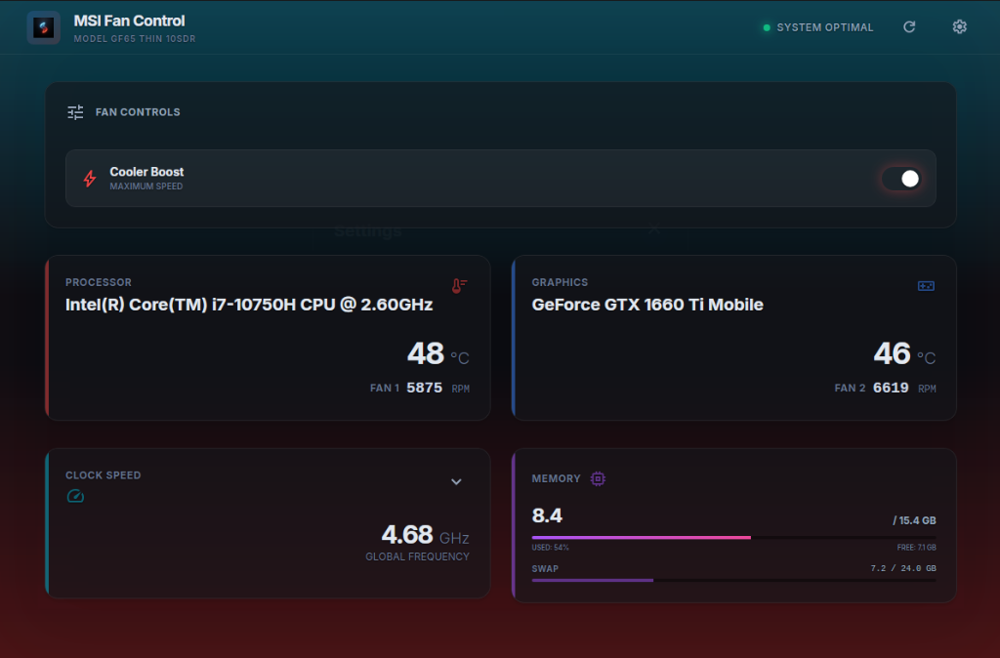
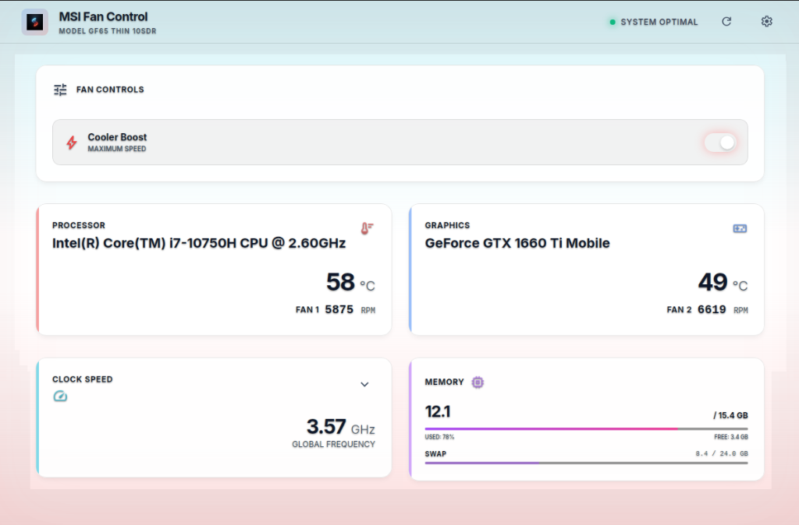
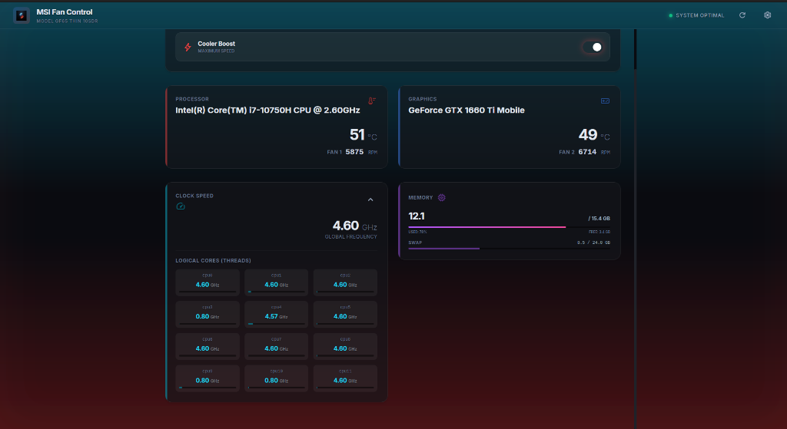
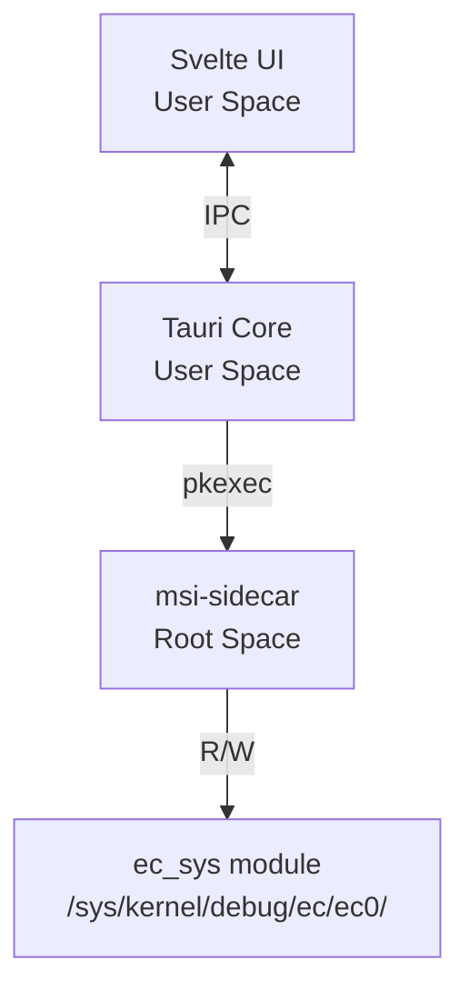

<div align="center">

# MSI Fan Control
### Unlock the full potential of your MSI laptop on Linux

[](https://github.com/desingh-rajan/msi-fan-control)
[](https://www.linux.org/)
[](LICENSE)

<br />


<br />
<br />

A dedicated utility to control MSI laptop fans on Linux (specifically Ubuntu), featuring a modern, glassmorphism-inspired UI.

</div>

---

## 📸 Gallery

<p align="center">
  
</p>

<p align="center">
  
  
</p>

---

## ✨ Features

- **🔥 Real-time Temperature Monitoring**: Monitor CPU and GPU temperatures instantly.
- **⚡ Real-time Fan Speed Monitoring**: Accurate RPM readings for both CPU and GPU fans.
- **🚀 Cooler Boost Toggle**: One-click activation of maximum fan speed mode for intense gaming or heavy workloads.
- **📈 CPU Clock Speed Monitoring**: View global and per-core clock speeds in real-time.
- **💾 Memory Usage**: Track RAM and Swap usage with visual progress bars.
- **🎨 Immersive UI**: Fully transparent, glassmorphism-based design with a dynamic "Fire & Ice" gradient theme.
- **🔒 Password-Free Operation**: Runs securely without password prompts after installation (Polkit policy bundled).
- **🖥️ System Tray Support**: Minimize to tray for unobtrusive background monitoring.
- **📝 Single Instance**: Optimized to run as a single instance with smart window focus handling.

## 🎯 Motivation

I created this tool because I bought an MSI laptop primarily for gaming, but I also use it heavily for web development work (Docker, Node.js, etc.). On Windows, MSI Dragon Center manages cooling, but there is no official support for Linux. I needed a way to manually toggle "Cooler Boost" (max fan speed) to manage heat during intense workloads.

**This project specifically targets the Cooler Boost functionality.**

## 💻 Supported Models

- **MSI GF65 Thin 10SDR** (Main development target)
- _More models planned for future releases_

## 🛠️ Installation

Download the latest release from [GitHub Releases](https://github.com/desingh-rajan/msi-fan-control/releases).

### From .deb (Debian/Ubuntu) - Recommended

```bash
sudo dpkg -i msi-fan-control_0.3.3_amd64.deb
```

**No additional setup required!** The installer automatically configures permissions. Just launch the app from your application menu.

### From AppImage

```bash
chmod +x msi-fan-control_0.3.3_amd64.AppImage
./msi-fan-control_0.3.3_amd64.AppImage
```

## ⚙️ How It Works

This application separates the UI (User Space) from the hardware control (Root Space) using a secure sidecar pattern.



The GUI runs as a normal user. Only the small `msi-sidecar` binary runs as root, authorized via standard Linux Polkit.

## 🐛 Known Issues & Troubleshooting

### "Connecting..." Stuck / Permission Denied
If the application gets stuck on "Connecting..." or shows `Permission denied` errors, it likely means the `ec_sys` kernel module was unloaded (common after kernel updates).

**Fix:**
```bash
sudo modprobe ec_sys write_support=1
```

To make this persistent across reboots:
```bash
echo "ec_sys" | sudo tee /etc/modules-load.d/ec_sys.conf
echo "options ec_sys write_support=1" | sudo tee /etc/modprobe.d/ec_sys.conf
```

## 👨‍💻 Development

### Requirements
- Node.js 20+
- Rust 1.70+
- Linux with GTK3 and WebKit2GTK

#### System Dependencies (Ubuntu 24.04)
```bash
sudo apt-get update
sudo apt-get install -y libgtk-3-dev libwebkit2gtk-4.1-dev libjavascriptcoregtk-4.1-dev libsoup-3.0-dev libappindicator3-dev librsvg2-dev patchelf libssl-dev build-essential curl wget file libssl-dev libayatana-appindicator3-dev
```

### Build from source

```bash
# Install dependencies
npm install

# Build sidecar binary
cd src-tauri/binaries/msi-sidecar
cargo build --release
cd ../../..
cp src-tauri/binaries/msi-sidecar/target/release/msi-sidecar \
   src-tauri/binaries/msi-sidecar-x86_64-unknown-linux-gnu

# Run in development mode
# First, set up permissions for the dev binary:
./scripts/setup-permissions.sh

npm run tauri dev

# Build for production
npm run tauri build
```

## 📜 Credits
Core hardware control logic, including EC register offsets and RPM calculation formulas, was researched and adapted from the excellent [MControlCenter](https://github.com/dmitry-s93/MControlCenter) project by Dmitry Serov.

## 📄 License
MIT
