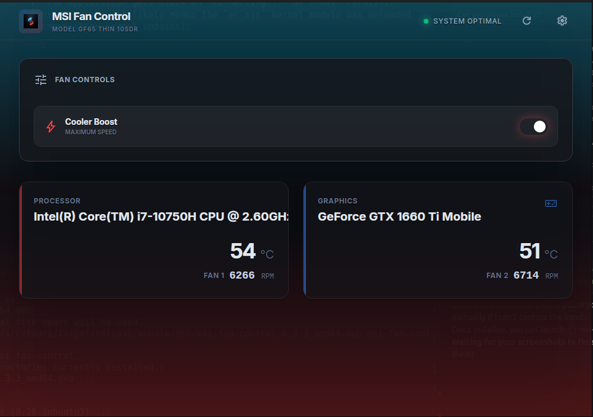
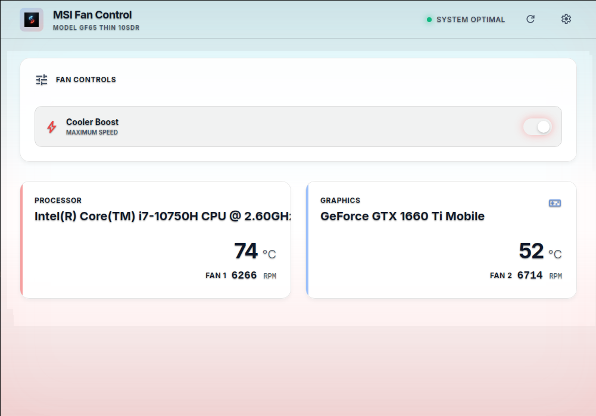

# msi-fan-control

A Tauri-based fan control utility for MSI laptops running Linux.


## Screenshots

<p align="center">
  
  
</p>


## MSI Fan Control

A dedicated utility to control MSI laptop fans on Linux (specifically Ubuntu).

## Motivation
I created this tool because I bought an MSI laptop primarily for gaming, but I also use it heavily for web development work (Docker, Node.js, etc.). On Windows, MSI Dragon Center manages cooling, but there is no official support for Linux. I needed a way to manually toggle "Cooler Boost" (max fan speed) to manage heat during intense workloads.

This project specifically targets the **Cooler Boost** functionality.


## Features
- **Real-time Temperature Monitoring**: Displays CPU and GPU temperatures.
- **Real-time Fan Speed Monitoring**: Accurate RPM readings for both CPU and GPU fans.
- **Cooler Boost Toggle**: Manually turn on/off the maximum fan speed mode.
- **Immersive UI**: Fully transparent, glassmorphism-based design with a dynamic "Fire & Ice" gradient theme.
- **Password-Free Operation**: Runs securely without password prompts after installation (Polkit policy bundled).
- **Single Instance**: Optimized to run as a single instance with window focus handling.
- **System Tray**: Minimize to tray for background monitoring.

## Roadmap

- **Extended Hardware Support** - Support for additional MSI laptop models

## Supported Models

- MSI GF65 Thin 10SDR (Main development target)
- _More models planned for future releases_

## Known Issues

### "Connecting..." Stuck / Permission Denied
If the application gets stuck on "Connecting..." or shows `Permission denied` errors, it likely means the `ec_sys` kernel module was unloaded (common after kernel updates).

**Fix:**
```bash
sudo modprobe ec_sys write_support=1
```

## Prerequisites

1. **Disable Secure Boot** in your BIOS settings.
2. Load the EC kernel module with write support:
   ```bash
   sudo modprobe ec_sys write_support=1
   ```

To make this persistent across reboots:

```bash
echo "ec_sys" | sudo tee /etc/modules-load.d/ec_sys.conf
echo "options ec_sys write_support=1" | sudo tee /etc/modprobe.d/ec_sys.conf
```

## Installation

Download the latest release from [GitHub Releases](https://github.com/desingh-rajan/msi-fan-control/releases).

### From .deb (Debian/Ubuntu) - Recommended

```bash
sudo dpkg -i msi-fan-control_0.3.3_amd64.deb
```

**No additional setup required!** The installer automatically configures permissions. Just launch the app from your application menu.

### From AppImage

```bash
chmod +x msi-fan-control_0.3.3_amd64.AppImage
./msi-fan-control_0.3.3_amd64.AppImage
```

## How It Works

This application separates the UI (User Space) from the hardware control (Root
Space) using a secure sidecar pattern.

```
┌─────────────────┐          ┌─────────────────┐
│   Svelte UI     │◄────────►│   Tauri Core    │
│  (User space)   │   IPC    │  (User space)   │
└─────────────────┘          └────────┬────────┘
                                      │ pkexec
                             ┌────────▼────────┐
                             │   msi-sidecar   │
                             │  (Root space)   │
                             └────────┬────────┘
                                      │ R/W
                             ┌────────▼────────┐
                             │  ec_sys module  │
                             │   /sys/kernel/  │
                             │  debug/ec/ec0/  │
                             └─────────────────┘
```

The GUI runs as a normal user. Only the small `msi-sidecar` binary runs as root,
authorized via standard Linux Polkit.

## Development

### Requirements

- Node.js 20+
- Rust 1.70+
- Linux with GTK3 and WebKit2GTK

#### System Dependencies (Ubuntu 24.04)

```bash
sudo apt-get update
sudo apt-get install -y libgtk-3-dev libwebkit2gtk-4.1-dev libjavascriptcoregtk-4.1-dev libsoup-3.0-dev libappindicator3-dev librsvg2-dev patchelf libssl-dev build-essential curl wget file libssl-dev libayatana-appindicator3-dev
```

### Build from source

```bash
# Install dependencies
npm install

# Build sidecar binary
cd src-tauri/binaries/msi-sidecar
cargo build --release
cd ../../..
cp src-tauri/binaries/msi-sidecar/target/release/msi-sidecar \
   src-tauri/binaries/msi-sidecar-x86_64-unknown-linux-gnu

# Run in development mode
# First, set up permissions for the dev binary:
./scripts/setup-permissions.sh

npm run tauri dev

# Build for production
npm run tauri build
```

## Credits
Core hardware control logic, including EC register offsets and RPM calculation formulas, was researched and adapted from the excellent [MControlCenter](https://github.com/dmitry-s93/MControlCenter) project by Dmitry Serov.

## License

MIT
